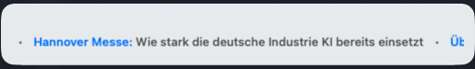
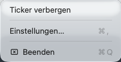
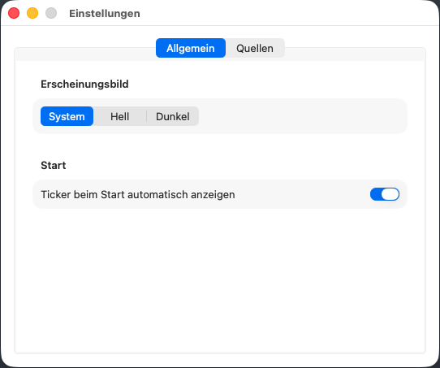
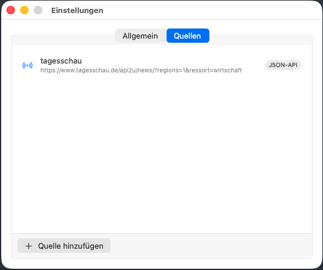
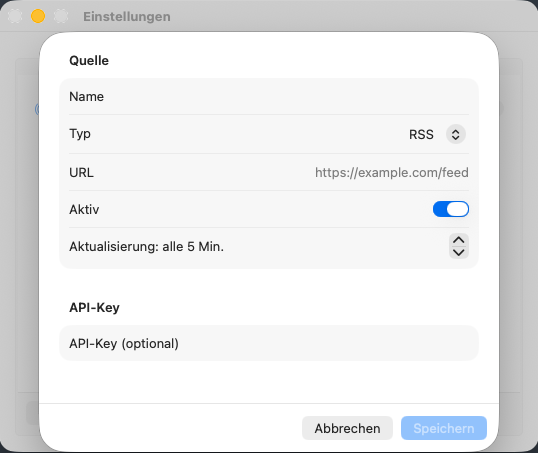

# News of the World

Eine leichtgewichtige native macOS-Menüleisten-App, die Schlagzeilen aus selbst konfigurierten Quellen als Laufschrift unter der Top Bar anzeigt. Unterstützt RSS, Atom und generische JSON-APIs, optional mit API-Key-Authentifizierung über den macOS-Keychain.



## Inhalt

- [Überblick](#überblick)
- [Systemvoraussetzungen](#systemvoraussetzungen)
- [Schnellstart](#schnellstart)
- [Installation](#installation)
- [Verwendung](#verwendung)
- [Einstellungen](#einstellungen)
- [Quellen anbinden](#quellen-anbinden)
- [Verhalten und Fehlerfälle](#verhalten-und-fehlerfälle)
- [Datenablage](#datenablage)
- [Architektur](#architektur)
- [Entwicklung](#entwicklung)
- [Bekannte Einschränkungen](#bekannte-einschränkungen)
- [Lizenz](#lizenz)

## Überblick

**News of the World** ist ein kleines macOS-Utility, das News-Headlines aus mehreren Quellen zusammenführt und als ruhige Laufschrift direkt unter der Menüleiste anzeigt. Der Fokus liegt auf:

- **Leichtgewichtig** — keine Electron-Schicht, keine externen Frameworks, minimaler Fußabdruck
- **Nativ** — Swift, SwiftUI + AppKit, Standard-macOS-Integration (Keychain, App-Sandbox, Appearance)
- **Privat** — alle Daten bleiben lokal; keine Cloud-Sync, keine Analytics, keine fremden SDKs
- **Erweiterbar** — neue Quelltypen lassen sich über ein Fetcher-Protokoll anschließen

## Systemvoraussetzungen

| Bereich | Anforderung |
| --- | --- |
| Betriebssystem | macOS 26.4 (Tahoe) oder neuer |
| CPU | Apple Silicon (arm64) |
| Bauumgebung | Xcode 26 oder neuer; Command-Line-Tools reichen **nicht** aus |
| Swift | Swift 5 Sprachmodus; Xcode liefert den passenden Compiler mit |
| Code-Signing | Lokales Ad-Hoc-Signing genügt, ein Apple-Entwicklerkonto ist nicht erforderlich |
| Berechtigungen | App-Sandbox mit `com.apple.security.network.client` sowie Keychain-Zugriff; beides ist im Projekt vorkonfiguriert |
| Netzwerk | Internetzugang zu den konfigurierten Feed- und API-Endpoints |
| Speicherbedarf | < 10 MB für die App; Quellen/Einstellungen werden im Sandbox-Container abgelegt |

Falls `xcodebuild` aus dem Terminal das Tool nicht findet ("requires Xcode"), einmalig auf die volle Xcode-Installation umschalten:

```sh
sudo xcode-select -s /Applications/Xcode.app/Contents/Developer
```

## Schnellstart

1. Repository klonen, `newsoftheworld.xcodeproj` in Xcode öffnen, Scheme **newsoftheworld** wählen, ⌘R.
2. Zeitungs-Icon in der Menüleiste anklicken → **Einstellungen…**.
3. Tab **Quellen** → **Quelle hinzufügen**.
4. Beispiel einfüllen: Name `tagesschau Wirtschaft`, Typ `JSON-API`, URL `https://www.tagesschau.de/api2u/news/?regions=1&ressort=wirtschaft`, Speichern.
5. Menü → **Ticker anzeigen** — das Panel erscheint unter der Menüleiste und beginnt nach wenigen Sekunden zu laufen.

## Installation

Aus den Quellen bauen:

```sh
git clone <repo-url>
cd newsoftheworld
open newsoftheworld.xcodeproj
```

In Xcode Scheme **newsoftheworld** wählen, ⌘R startet die App direkt. Der Build erzeugt ein reguläres `.app`-Bundle; es kann aus dem DerivedData-Ordner bei Bedarf auch herauskopiert werden.

Build ohne Xcode-IDE:

```sh
xcodebuild \
  -project newsoftheworld.xcodeproj \
  -scheme newsoftheworld \
  -configuration Debug \
  -destination 'platform=macOS' \
  build
```

Ein vorkompiliertes Release gibt es aktuell nicht.

## Verwendung

### Menüleiste



Nach dem Start erscheint ein Zeitungs-Icon in der Menüleiste. Klick öffnet ein Menü mit drei Einträgen:

- **Ticker anzeigen / verbergen** — blendet das Laufschrift-Panel ein oder aus. Der Label-Text passt sich an den aktuellen Zustand an.
- **Einstellungen…** (⌘,) — öffnet das Einstellungsfenster.
- **Beenden** (⌘Q) — beendet die App.

Die App hat absichtlich kein Dock-Icon und kein Hauptfenster. Sie lebt komplett in der Menüleiste.

### Ticker-Panel

Das Panel positioniert sich automatisch direkt unter dem Menüleisten-Icon, schwebt über anderen Fenstern und verschwindet nicht beim Fokuswechsel. Es enthält ausschließlich die horizontale Laufschrift — keine Bedienelemente, um visuell ruhig zu bleiben.

Darstellungsdetails:

- Kategorie der Quelle (falls vom Feed geliefert) als farbiger Präfix vor dem Titel
- Trennzeichen zwischen Headlines
- Einzeiliges Layout mit Fade-am-Rand-Animation; lange Titel werden sauber behandelt

## Einstellungen

Das Einstellungsfenster hat zwei Tabs.

### Allgemein



- **Erscheinungsbild** — System / Hell / Dunkel, wirkt sofort auf Ticker-Panel und Einstellungsfenster.
- **Ticker beim Start automatisch anzeigen** — öffnet das Panel direkt nach dem App-Start, ohne dass man erst klicken muss.

### Quellen



Listet alle eingerichteten Quellen. Pro Zeile:

- Icon für aktiv (orange Antenne) oder deaktiviert (Pause-Symbol)
- Name und URL
- Typ-Badge (RSS / Atom / JSON-API)
- Schlüsselsymbol, wenn ein API-Key hinterlegt ist

Interaktion:

- **Doppelklick** auf eine Zeile öffnet den Bearbeiten-Dialog
- **Rechtsklick** öffnet ein Kontextmenü mit *Bearbeiten* und *Entfernen*
- **+ Quelle hinzufügen** öffnet das Quellenformular für eine neue Quelle

### Quellenformular



| Feld              | Beschreibung                                                                    |
| ----------------- | ------------------------------------------------------------------------------- |
| Name              | Frei wählbar, nur intern zur Organisation — wird nicht im Ticker angezeigt      |
| Typ               | RSS, Atom oder JSON-API                                                         |
| URL               | Feed- oder API-Endpoint; https empfohlen                                        |
| Aktiv             | Aktive Quellen werden regelmäßig abgefragt, inaktive bleiben stumm              |
| Aktualisierung    | Polling-Intervall, 1–60 Minuten, Standard 5 Minuten                             |
| API-Key (optional) | Wird als `Authorization: Bearer <key>` gesendet und im Keychain abgelegt       |

Das API-Key-Feld bleibt beim Bearbeiten immer leer. Ist bereits ein Key hinterlegt, wird das angezeigt und kann entweder *entfernt* oder durch Eingabe eines neuen Werts überschrieben werden. Der gespeicherte Klartext-Key verlässt den Keychain niemals; er wird nur on-demand beim Fetch in den Request-Header eingesetzt.

Nach **Speichern** startet der Scheduler die betroffene Quelle sofort neu — ohne App-Neustart.

## Quellen anbinden

### RSS / Atom

Standardkonforme XML-Feeds werden direkt verstanden. Aus jedem `<item>` (RSS) bzw. `<entry>` (Atom) werden folgende Felder extrahiert (erste Übereinstimmung gewinnt):

| Zielfeld        | Akzeptierte Elemente                                                    |
| --------------- | ----------------------------------------------------------------------- |
| Titel           | `<title>`                                                               |
| Link            | `<link>…</link>` (RSS), `<link rel="alternate" href="…"/>` (Atom)       |
| Datum           | `<pubDate>`, `<published>`, `<updated>`, `<dc:date>`                    |
| Zusammenfassung | `<description>`, `<summary>`, `<content>`                               |
| Autor           | `<author>`, `<dc:creator>`                                              |
| ID              | `<guid>`, `<id>`                                                        |

Unterstützte Datumsformate: ISO-8601 (mit oder ohne fraktionale Sekunden) und RFC-822 (typisches RSS-`pubDate`).

### JSON-API

Der JSON-Fetcher erkennt mehrere gängige Container-Formen automatisch.

Am Root akzeptiert werden:

1. Ein Array von Items: `[ {…}, {…} ]`
2. Ein Objekt mit einem der Schlüssel: `items`, `articles`, `news`, `results`, `data`, `entries`, `posts`

Pro Item wird jeweils der erste passende Schlüssel verwendet:

| Zielfeld        | Akzeptierte Schlüssel                                                              |
| --------------- | ---------------------------------------------------------------------------------- |
| Titel           | `title`, `headline`, `name`                                                        |
| URL             | `url`, `link`, `canonical_url`, `permalink`, `detailsweb`, `shareURL`              |
| Datum           | `publishedAt`, `published_at`, `pubDate`, `published`, `date`, `updated`           |
| Zusammenfassung | `summary`, `description`, `excerpt`, `firstSentence`                               |
| Autor           | `author`, `byline`, `creator`                                                      |
| ID              | `id`, `guid`, `uuid`, `externalId`, `sophoraId`                                    |
| Kategorie       | `topline`, `kicker`, `category`                                                    |

Die Kategorie wird im Ticker als farbiger Präfix gerendert: *"Hannover Messe: Wie stark die deutsche Industrie KI bereits einsetzt"*.

### Authentifizierung

Aktuell ausschließlich **Bearer-Token** über den `Authorization`-Header. API-Keys als Query-Parameter, Basic-Auth oder individuelle Header sind noch nicht implementiert — siehe [Bekannte Einschränkungen](#bekannte-einschränkungen).

Ablauf:

1. Im Quellenformular API-Key eintragen, Speichern.
2. Der Key landet im Keychain unter Service `de.paulkirchhoff.newsoftheworld`, Account `source.<UUID>`.
3. Bei jedem Fetch für diese Quelle wird `Authorization: Bearer <key>` automatisch ergänzt.

### Beispiel: tagesschau-Wirtschaftsressort

Eine reale JSON-API ohne API-Key.

1. **+ Quelle hinzufügen**
2. Felder:
   - Name: `tagesschau Wirtschaft`
   - Typ: `JSON-API`
   - URL: `https://www.tagesschau.de/api2u/news/?regions=1&ressort=wirtschaft`
   - Aktiv: ja
   - Aktualisierung: 5 Min.
   - API-Key: (leer lassen)
3. **Speichern** → der Scheduler fragt die Quelle sofort ab.
4. **Menü → Ticker anzeigen** — der Ticker zeigt Headlines mit `topline`-Präfix (z. B. *"Steigender DAX: Prinzip Hoffnung an der Börse"*).

Die Antwort ist ein Objekt mit dem Schlüssel `news`, das der Fetcher automatisch erkennt. Pro Item werden `externalId`, `title`, `date`, `firstSentence`, `shareURL` und `topline` gemappt — ohne zusätzliche Konfiguration.

## Verhalten und Fehlerfälle

| Situation                                           | Was der Ticker zeigt                                                |
| --------------------------------------------------- | ------------------------------------------------------------------- |
| Keine Quelle konfiguriert                           | "Keine Quellen konfiguriert"                                        |
| Alle Quellen deaktiviert                            | wie oben                                                            |
| Erste Ladeaktion läuft, noch keine Items            | "Lade Nachrichten …"                                                |
| Mindestens eine Quelle liefert Items                | Laufschrift mit allen Items, sortiert nach Datum absteigend         |
| Einzelne Quelle fehlerhaft, andere liefern          | Fehler wird still ignoriert; Laufschrift läuft weiter               |
| Alle aktiven Quellen schlagen fehl                  | Fehlermeldung der ersten fehlschlagenden Quelle im Ticker           |
| Quelle deaktiviert oder gelöscht                    | Ihre Items verschwinden sofort aus dem Ticker                       |

Refresh-Verhalten:

- Pro Quelle läuft ein eigener Scheduler-Task; die Intervalle sind unabhängig voneinander.
- Beim Speichern einer Quelle (Anlegen, Bearbeiten, Löschen, Aktiv/Inaktiv) wird die betroffene Quelle sofort erneut gefetcht.
- Internes Minimum liegt bei 30 Sekunden (hartes Guard gegen versehentlichen Spam), obwohl das UI 1 Minute als Mindestwert anbietet.

## Datenablage

| Was           | Wo                                                                                                                              |
| ------------- | ------------------------------------------------------------------------------------------------------------------------------- |
| Einstellungen | `UserDefaults`, Schlüssel `app_settings_v1`                                                                                     |
| Quellen       | `~/Library/Containers/de.paulkirchhoff.newsoftheworld/Data/Library/Application Support/NewsOfTheWorld/sources.json`             |
| API-Keys      | macOS-Keychain, Service `de.paulkirchhoff.newsoftheworld`, Account `source.<UUID>`                                              |

Die App läuft in der App-Sandbox mit genau zwei Entitlements: `com.apple.security.app-sandbox` und `com.apple.security.network.client`. Keine Datei- oder Systemzugriffe außerhalb des eigenen Containers.

## Architektur

Vier Schichten mit klarer Trennung. Vollständige Spec in `newsoftheworld-starter/ai-context/architecture.md`, Kontext für Claude Code in `CLAUDE.md`.

```
Presentation    SwiftUI + AppKit — Status-Bar-Menu, Ticker-Panel (NSPanel),
                Einstellungsfenster, ViewModels
Application     Ports (NewsFetcher, Repositories, SecretStore),
                Services (RefreshCoordinator, FetcherResolver)
Domain          NewsItem, NewsSource, AppSettings, TickerState
Infrastructure  URLSessionHTTPClient, XMLFeedFetcher, JSONFeedFetcher,
                JSONNewsSourceRepository, UserDefaultsSettingsRepository,
                KeychainSecretStore
```

Konsequenzen:

- Views rufen keine Netzwerk-, Datei- oder Keychain-APIs direkt auf — alles geht über die Ports im Application-Layer.
- Domain-Modelle sind framework-frei, `Codable`, `Sendable`, `nonisolated` — damit Fetcher sie im Hintergrund erzeugen können.
- Neue Quelltypen lassen sich durch einen weiteren `NewsFetcher` und einen Eintrag im `FetcherResolver` ergänzen.

## Entwicklung

Tests ausführen (Swift Testing + XCTest):

```sh
xcodebuild \
  -project newsoftheworld.xcodeproj \
  -scheme newsoftheworld \
  -destination 'platform=macOS' \
  test
```

Einzelnen Test ausführen:

```sh
xcodebuild \
  -project newsoftheworld.xcodeproj \
  -scheme newsoftheworld \
  -destination 'platform=macOS' test \
  -only-testing:newsoftheworldTests/newsoftheworldTests/example
```

Das Xcode-Projekt verwendet **File System Synchronized Groups** — neue Dateien im Ordner `newsoftheworld/` werden automatisch in den Build aufgenommen, ohne dass `project.pbxproj` manuell editiert werden muss.

## Bekannte Einschränkungen

- JSON-Mapping ist aktuell ein fixer Satz von Schlüsselkandidaten — noch nicht pro Quelle konfigurierbar.
- Authentifizierung nur als Bearer-Token; kein Basic-Auth, keine Query-Parameter-Keys, keine Custom-Header.
- Refresh-Verhalten speichert Items nur im Arbeitsspeicher; nach einem Neustart wird neu geladen.
- Die Ticker-Geschwindigkeit ist aktuell nicht in der UI einstellbar (Feld existiert im Modell und wird vorbereitet).
- Kein Launch-at-Login über Systemeinstellungen (separat geplant).
- Noch keine Unit-Tests für die Feed-Parser.

## Lizenz

MIT — siehe [LICENSE](LICENSE).
